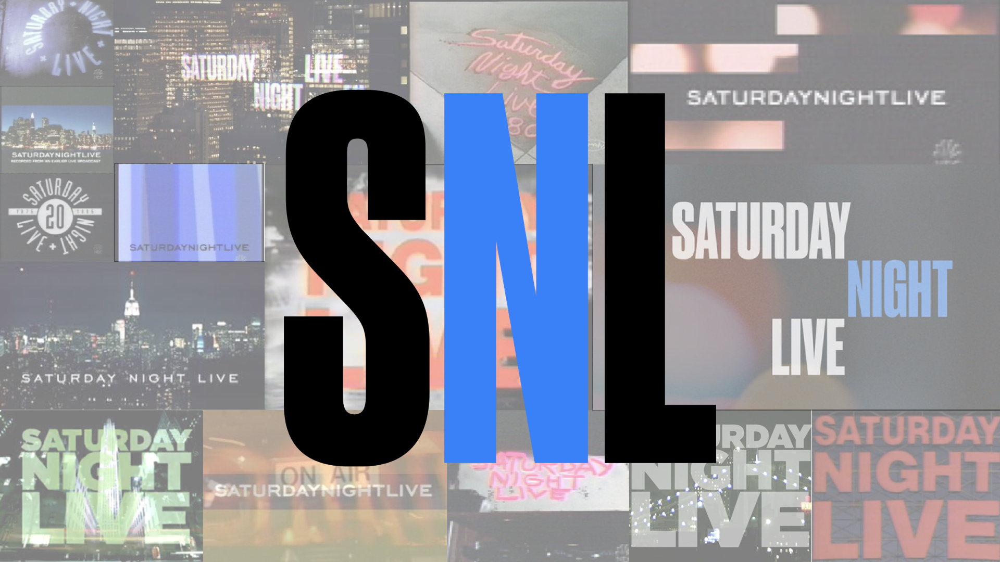

<style type="text/css">
body {
  font-size: 16px;
  font-family: Roboto, sans-serif;
}
</style>



# 42 Years In, A Look Back At Saturday Night Live
Alex Wainger (atw2131)
<br>
EDAV Final Project — April 20, 2017
<br>

## 1. Introduction
Since its inception in 1975, Saturday Night Live (SNL) has encapsulated the current state of pop-culture with each weekly episode. From Eddie Murphy and Will Ferrell launching their careers in the 80's and 90's to Tina Fey, Alec Baldwin and Melissa McCarthy unleashing iconic political impressions, SNL's time on-air has spanned 5 decades and is a treasure trove for analysis. Each episode features a guest host (usually a comic or actor) and a musical guest that performs at the end of the episode. Inspired by a [FiveThirtyEight article](https://fivethirtyeight.com/datalab/every-guest-jon-stewart-ever-had-on-the-daily-show/) on Jon Stewart's guests over the years, I wanted to take a closer look at who has been featured on SNL over the last 40+ years, and how the makeup of the guests have changed over time. 
<br>

A complete dataset of SNL guests doesn't exist, as far as I can tell from half-an-hour of Googling. So, like they did at FiveThirtyEight, I scraped [3](https://en.wikipedia.org/wiki/List_of_Saturday_Night_Live_episodes_(seasons_1%E2%80%9315)#Episodes) [Wikipedia](https://en.wikipedia.org/wiki/List_of_Saturday_Night_Live_episodes_(seasons_16%E2%80%9330)#Episodes) [articles](https://en.wikipedia.org/wiki/List_of_Saturday_Night_Live_episodes) to get a listing of every host and musical guest SNL has ever had. I supplemented the basic info in those Wikipedia tables with data from Google's Knowledge Graph and the individual or group's own Wikipedia page (the process is explained in section 3). The data, as well as the scraper programs can be found in the [github repo](https://github.com/alexwainger/SNLOverTheYears), along with an explanation for running the code.
<br>

## 2. Team
I worked on this project alone, so I'll use this space to describe the steps I took to make this all happen. Obviously, the first step was collecting the data. I wrote a Python scraper that grabbed each row from the Wikipedia tables. I then used the [Google Knowledge Graph API](https://developers.google.com/knowledge-graph/) to categorize what each person or group does, as well as scrape the person or group's Wikipedia page for some additional info. With that data collected, I did some cleaning steps (described in section 3) to ensure my visualizations would be accurate and informative.
<br>

Once I had a clean, solid dataset, I went to work on the visualizations that appear below. I tried out many more things than made it into the report. A lot of my attempts just didn't show anything interesting, e.g. a graph showing host industry changes over time revealed that from the start, actors have dominated and continue to dominate the hosting job, and really nothing has changed since the start of the show in that regard. If I had more time, I might have tried to get more information about these actors, e.g. what types of movies they act in, to see if there were any changes there, but I didn't get around to it.

## 3. Analysis of Data Quality
Since I scraped the dataset myself, I'm pretty confident in the quality of it. As I've mentioned, there were a few steps needed to collect this dataset. My Python scraper went through each row of the SNL episode listings, grabbed the date, season, episode number, host and musical guests name and wikipedia link. I then sent the two names to the knowledge graph. To use the knowledge graph, you simply send Google a query term, and they'll send you back a list of entities, ranked by relevance to your query, with a bunch of different pieces of information, like a short description (Rock band, Former US Senator, Stand-up comedian, etc.), the type of the entity (person, place, movie, etc.), and much more. I stored the description and type for the top result of each API call.
<br>

I also went to each of the host and musical guests' Wikipedia pages and scraped birthdays, genres and genders, when applicable. Gender isn't actually listed on a person's Wikipedia page, so if the knowledge graph told me that the entity I searched for was a person, I'd count the number of times "he" and "she" appeared in their Wikipedia page and assign them that gender. I made sure to check pages where the difference between these two counts was small, but this heuristic for determining gender got it right nearly every time.
<br>

The results of that scraper were somewhat mixed. The knowledge graph results weren't always correct (e.g. querying for "Prince" gave me a result for "Charles, Prince of Wales"). Luckily, each knowledge graph result had a link to the entity's Wikipedia page, so if that link didn't match the one I had from scraping the episode tables, then I would just do that host or musical guest by hand using the knowledge graph's [web interface](https://developers.google.com/apis-explorer/#search/knowledge/kgsearch/v1/kgsearch.entities.search). Once I fixed those mistakes by hand, I did some further sanity checking and editing where needed -- making sure that bands didn't have birthdays or genders, that birthdays fell in a reasonable range and had the correct format, etc. These changes can all be seen in the Edits.txt file and the cleaner.py script.
<br>

I then made some ad hoc bar charts in R to make sure there weren't any surprising values or categories in any of the variables. These all turned out to be as expected, so I did not include most of them. Below is one sample, it shows the different possible values for the host's category, a meta-variable I created based on the knowledge graph description.
<br>
```{r, echo=FALSE}
library(ggplot2)
library(dplyr)
library(tidyr)
hosts = read.csv("data/hosts3.csv")
musical_guests = read.csv("data/musical_guests3.csv")
host_category_counts <- hosts %>% group_by(category) %>% summarise(count = n())
ggplot(data=host_category_counts, aes(x=reorder(category, count), y=count)) + geom_bar(stat="identity", fill="#440154FF")  + coord_flip() +
  labs(
    title="Host Category Sanity Check",
    y="Count",
    x=""
  ) + theme_minimal(14)
```

## 4. Executive Summary
Most of my analysis focuses on the changes of different variables over time. So for the executive summary, I've included two graphs that I think display the most interesting changes over time that I discovered in this project. The first shows the percentage of hosts that were women in each season, while the second shows the changes in genres of the musical guests across decades.
<br>
```{r, echo=FALSE}
library(scales)
hosts$year <- strtoi(format(as.Date(hosts$date, format='%Y-%m-%d'), '%Y'))
hosts$decade <- floor(hosts$year / 10) * 10
hosts_with_gender <- hosts %>% filter(gender != "")

hosts_gender_percents_year <- hosts_with_gender %>% group_by(year) %>%
  summarise(male = sum(ifelse(gender=='Male',1,0)) / n(), female=sum(ifelse(gender=='Female',1,0)) / n())

ggplot(data = hosts_gender_percents_year, aes(x=year, y=female)) + 
  geom_point(color='#440154FF') + 
  geom_smooth(method = "lm", color='#FDE725FF', level=0) +
  scale_y_continuous(labels=percent, limits=c(0,.5)) +
  annotate("text", x=1981, y=.5, label="Jean Doumanian's season", hjust=-.03) +
  theme_minimal(14) +
  labs(
    title="Gender of Hosts Trends Towards Equality",
    x="Year",
    y="Percent Female"
  )
```
This scatterplot shows each year of SNL as a point, with a trend line drawn as well. You can see from the trend line that the gender of SNL hosts has been slowly but surely approaching an equitable split. Back in the late 70's and early 80's, the trend line shows roughly a quarter of hosts were female, compared to over 1/3 female by the 2010's. It will be interesting to keep an eye on this trend through the end of this decade and the start of the next and see if it continues on its current trajectory.
<br>

One interesting outlier was the year 1981, when the host gender ratio was an even 50/50 split — the only time in 42 seasons that there was an even number of male and female hosts. There were a couple reasons for this outlier: first, season 6 was shorter than usual. Most seasons of SNL are made up of 20 episodes, but there were only 13 in 1981 because of a strike by the Writers' Guild of America. Episode 13 did not have a guest host, so that left just 12 episodes, 6 of which hosted by women. Those first 12 episodes of the season were produced by Jean Doumanian, the only time in the show's history that it had a female producer. Lorne Michaels, one of two creators of SNL and the show's first producer, took a year off, leaving Doumanian in charge. Her run was short-lived, as she was replaced after those  12 episodes by Dick Ebersol, another of the show's creators. While it may have been a coincidence caused by the shortened season, perhaps Doumanian made a point of featuring female hosts during her time in command.
<br>

Shifting gears and turning to the musical guests, this area chart shows the make up of the top genres of SNL musical guests and how their presence on the show has changed over time.

```{r, echo=FALSE}
library(viridis)
musical_guests$year <- strtoi(format(as.Date(musical_guests$date, format='%Y-%m-%d'), '%Y'))
musical_guests$decade <- floor(musical_guests$year / 10) * 10
unnested_genres <- musical_guests %>% mutate(genres = strsplit(as.character(genres), ",")) %>% unnest(genres)
top_genres <- unnested_genres %>% group_by(genres) %>% summarise(Freq = n()) %>% filter(Freq > 75) %>% select(genres)

top_unnested_genres <- unnested_genres %>% filter(genres %in% top_genres$genres)
tab <- table(top_unnested_genres$decade, top_unnested_genres$genres)
genre_decade_frequency <- data.frame(tab / rowSums(tab))

ggplot(genre_decade_frequency) + 
  geom_area(aes(x=Var1, y=Freq, group=Var2, fill=Var2)) + 
  scale_fill_viridis(discrete = TRUE)  +
  scale_y_continuous(name="", labels = percent) +
  guides(fill=guide_legend(title = "Musical Guest Genre")) +
  theme_minimal(14) + labs(
    title="Out with Rock, In with Hip Hop",
    x="Decade"
  )
```
To clarify, there were obviously more than 7 genres of music ever featured on SNL, but to make this graph more concise and interesting, we are only considering the top 7 most common genres, and how they've changed in relation to one another. There are a number of interesting observations from this graph. Starting from the bottom, soul remains relatively stable, though it saw a decently large drop off from the 80's to the 90's. Rock is probably the biggest loser of the graph. Rock dominated with over 1/3 musical guests in the 70's, but has been reduced to the smallest sliver in the 2010's. R&B tapered off slightly in the 80's and 90's but has definitely made a comeback in this century. Pop rock is probably the most niche genre on the graph, and stays relatively consistent over the 5 decades. Unlike rock, pop has managed to maintain a steady presence throughout the history of SNL. Hip hop was still in it's infancy in the 70's, but has exploded to account for a large proportion of today's musical guests. Similarly, alt-rock didn't show up until the 80's, but had a dominant stretch throughout the 90's.
<br>

Notably, jazz was the 8th largest genre and was the inverse of hip hop — jazz was super popular in the 70's and 80's, but has all but died out from the SNL stage this century. These trends in musical guests genres seem to pretty closely reflect the state of music in America, which makes sense considering SNL tends to book popular bands and artists to appeal to its wide audience. Hip hop and pop have replaced jazz and rock at the top of the mantle, both in SNL and in the country.
<br>

Some other interesting insights from the analysis included: the median female host age is significantly lower than the median male host age, bands have had an up-and-down time on SNL, going from making up ~20% of the musical acts in the 70's to nearly half in the 90's, and back down to around 40% in the 2010's, and SNL's alt and pop rock musical guests have been predominantly bands, while the other 5 top genres are typically solo acts.

## 5. Main Analysis
### Hosts
I've included the two graphs from the executive summary in the main analysis section so that you can see the code behind them. I started off by focusing on hosts, particularly the differences between male and female hosts.

```{r}
hosts_with_gender <- hosts %>% filter(gender != "")

hosts_gender_percents_year <- hosts_with_gender %>% group_by(year) %>%
  summarise(male = sum(ifelse(gender=='Male',1,0)) / n(), female=sum(ifelse(gender=='Female',1,0)) / n())

ggplot(data = hosts_gender_percents_year, aes(x=year, y=female)) + 
  geom_point(color='#440154FF') + 
  geom_smooth(method = "lm", color='#FDE725FF', level=0) +
  scale_y_continuous(labels=percent, limits=c(0,.5)) +
  annotate("text", x=1981, y=.5, label="Jean Doumanian's season", hjust=-.03) +
  theme_minimal(14) +
  labs(
    "title"="Gender of Hosts Trends Towards Equality",
    "x"="Year",
    "y"="Percent Female"
  )
```
As I discussed in the executive summary, women are starting to get an equitable number of hosting gigs, but the trend line would suggest that we're still a few decades away from a completely fair 50/50 split. Interestingly, you can see in the bar graph below that when you break the datapoints up by decade rather than individual year, the 80's were actually slightly worse for women than the 70's, but the upward trend since then is definitely evident.

```{r}
hosts_gender_percents_decade <- hosts_with_gender %>% group_by(decade) %>%
  summarise(male = sum(ifelse(gender=='Male',1,0)) / n(), female=sum(ifelse(gender=='Female',1,0)) / n())

ggplot(data = hosts_gender_percents_decade, aes(x=decade, y=female)) + 
  geom_col(fill='#440154FF') + 
  scale_y_continuous(labels = percent, name="Percent Female") +
  theme_minimal(14) +
  labs(
    title="After 80's Setback, Host Gender Ratio Rebounds",
    x="Decade"
  )
```
Next, I took a look at the age of the hosts, to see if there was a difference there too. Looking first at a density plot, we can see a definite difference between the male and female hosts.
```{r}
birthdays <- as.POSIXct(hosts$bday, format='%Y-%m-%d')
show_dates <- as.POSIXct(hosts$date, format='%Y-%m-%d')
hosts$ages <- difftime(show_dates,birthdays,units="days") / 365
ggplot(data=hosts %>% filter(gender != ""), aes(x=ages, fill=gender)) +
  geom_density(alpha=.7) +
  scale_x_continuous(name="Age as Host") +
  scale_fill_viridis(name="Gender",discrete = TRUE) +
  theme_minimal(14) +
  labs(
    title="Female Hosts Tend to be Younger Than Male Counterparts",
    y="Density"
  )
```
There are two interesting characteristics of these roughly normally distributed densities. First, and most poingiant, is the fact that the peak of the female desity is shifted to the left by a few years, meaning your typical female host is a few years younger than your typical male host. The other interesting characteristic is how quickly the female density drops to 0 after around 50, while the slope of the male density actually lessens right after 50. There is a pretty large number of 50+ male hosts, while women that old tend not to host SNL. The female density also extends out past 75, while the male does not — these outliers will be explained in the next graph.
<br>
```{r}
ggplot(hosts %>% filter(gender != "" & !is.na(ages)), aes(x=factor(decade), y=ages, fill=factor(gender))) + 
  geom_boxplot(notch = TRUE) + 
  scale_fill_viridis(name="Gender",discrete = TRUE) +
  scale_y_continuous(name="Age as Host") +
  annotate("text", x=factor(2010), y=88.5, label="Betty White (88)", hjust=1.25) +
  annotate("text", x=factor(1990), y=7.8, label="Drew Barrymore (7)", hjust=.85) +
  annotate("text", x=factor(1980), y=80.5, label="Miskel Spillman (80)", hjust=.85)  +
  theme_minimal(14) + labs(
    title="Median Female Host Age Uniformly Lower Than Male's",
    x="Decade"
  )
```
I wanted to see if host age has changed over time, for both men and women, so I made the above series of box plots. The notches in the box plots indicate a 95% confidence interval around the median, i.e. if the notches of two box plots don't overlap, then we can be sure that the medians are different with 95% confidence. Looking at the notches, we can see overlap between men and women in just one decade — 2010 — while the female median is statistically significantly lower in the other four decades. In terms of changes over time, there isn't too much I can glean from the box plots. 2010 is certainly an older decade than 2000 was, but there doesn't seem to be an overarching trend in ages over time.
<br>

I also took the opportunity to label and explain a couple of interesting outliers. The earliest, Miskel Spillman, was 80 when she hosted the show and was not actually a celebrity — she was the winner of the "Anyone Can Host" contest that SNL held during season 3. Spillman won the contest and was the oldest SNL host for nearly 40 years, before Betty White took the crown as an 88 year-old host in 2010. On the other end of the spectrum, child-star Drew Barrymore is the youngest host ever, having led the show at merely 7 years old. Barrymore also holds the record for most hosting appearances by a woman with 6.

### Musical Guests
Turning our attention to the musical guests, I was most interested in the different genres of music that have appeared on SNL, and wanted to see how closely they mirrored my understanding of the history of music in America. As I did in the hosts section, I've included the graph from the executive summary with the code revealed.
```{r}
unnested_genres <- musical_guests %>% mutate(genres = strsplit(as.character(genres), ",")) %>% unnest(genres)
top_genres <- unnested_genres %>% group_by(genres) %>% summarise(Freq = n()) %>% filter(Freq > 75) %>% select(genres)

top_unnested_genres <- unnested_genres %>% filter(genres %in% top_genres$genres)
tab <- table(top_unnested_genres$decade, top_unnested_genres$genres)
genre_decade_frequency <- data.frame(tab / rowSums(tab))

ggplot(genre_decade_frequency) + 
  geom_area(aes(x=Var1, y=Freq, group=Var2, fill=Var2)) + 
  scale_fill_viridis(discrete = TRUE)  +
  scale_y_continuous(name="", labels = percent) +
  guides(fill=guide_legend(title = "Musical Guest Genre")) +
  theme_minimal(14) + labs(
    title="Out with Rock, In with Hip Hop",
    x="Decade"
  )
```

Another aspect of the musical guests I was interested in was the band vs. individual acts. The knowledge graph gave me two values for musicians — "musicgroup"" or "person"", with "musicgroup"" referring to a band. I first wanted to check to make sure there weren't any other categories I had to consider:
```{r}
ggplot(musical_guests,aes(x=types)) +
  geom_bar(fill="#440154FF") +
  theme_minimal(14) +
  labs(
    title="Musical Guest Type Imbalance Favors Solo Acts",
    x="Knowledge Graph Types",
    y="Count"
  )
```
With that confirmed, I broke down the percentage of musical acts that were bands by year, and also plotted the average percentages of guests that were bands for each decade.
```{r}
musician_types_decade <- musical_guests %>% group_by(decade) %>%
  summarise(Band=sum(ifelse(types=='MusicGroup',1,0)) / n())
musician_types_year <- musical_guests %>% group_by(year) %>%
  summarise(Band=sum(ifelse(types=='MusicGroup',1,0)) / n())

ggplot(musician_types_year,aes(x=year, y=Band)) +
  geom_col(alpha=.5, fill='#440154FF') +
  geom_point(data=musician_types_decade, aes(x=decade + 5, y=Band), color='#FDE725FF', size=3)  +
  scale_y_continuous(labels = percent, name="Percent of Band Musical Guests") +
  annotate("text", x=1983, y=.58, label="Yellow points are decade averages.") +
  theme_minimal(14) +
  labs(
    title="The Rise and Fall of Bands as Musical Guests",
    x="Year"
  )

```
The data is a little noisy when broken down by year, but I think the decade average points indicate the rough trend — there was a dearth of bands in the 70's, with only around 20% of acts being bands, but by the 90's, that number jumped all the way up to ~50%. Since the 90's, however, the percentage of bands has dropped back down to the mid-30s. This rise and fall seemed kind of strange to me, so I made this mosaic plot to investigate it further:
```{r}
library(ggmosaic)
tab2 <- table(top_unnested_genres$types, top_unnested_genres$genres)
genre_type_frequency <- data.frame(tab2 / rowSums(tab2))
x <- genre_type_frequency$Var1
levels(x)[levels(x)=="Person"] <- "Individual"
levels(x)[levels(x)=="MusicGroup"] <- "Band"
genre_type_frequency$Var1 <- x

ggplot(data=genre_type_frequency) + geom_mosaic(aes(weight=Freq, x=product(Var2), fill=Var1)) +
  coord_flip() +
  guides(fill=guide_legend(title = "Musical Guest Type", reverse = TRUE)) +
  scale_y_continuous(labels = percent) +
  scale_fill_viridis(discrete = TRUE) +
  theme_minimal(14) +
  labs(
    title="Alt and Pop Rock Acts Tend To Be Bands",
    x="Genre"
  )
```
The mosaic plot shows the breakdown of solo acts vs. bands for the top 7 genres we identified earlier. As you can see, alt and pop rock stand out as predominantly bands, particularly alt rock acts at nearly 90%. Combined with the insights we had from the area plot earlier, this can start to explain the rise and fall of bands on SNL. As I explained earlier, we saw that alt-rock musical guests rose to prominence in the 90's after not appearing on the show at all in the 70's, but then faded out by the 2010's. Because alt-rock acts are so commonly bands, the rise of bands in the 90's can probably be attributed to SNL booking a ton of alt-rock musical guests. And in contrast, pop and hip hop groups have become much more common in the last decade, and each of those genres are around 75% solo acts.

## 6. Conclusion
And there you have it! I thought this project turned out to be pretty successful, with a fair number of interesting takeaways about SNL hosts and musical guests. I made an effort to create different types of visualizations to display the different pieces of information, and I think each was appropriate and did its job. I also made sure to use the viridis color scheme so that the report is color-vision-impaired friendly.
<br>

If I had more time, I definitely would have collected more data. After playing around with a number of variables, I realized some things that I collected weren't very interesting or didn't have any significant patterns. For example, I mentioned that actors are the dominant professor of hosts, so the knowledge graph description of hosts didn't tell me much, since probably 90% of them were actors. If I had realized this early enough, I could have tried to scrape some additional data on those actors' movie / TV shows to see what types of actors host SNL and how that has changed over time.
<br>

I also would have loved to scrape some data on popular music, e.g. Billboard Top 40 rankings or top-grossing albums by year, as this would have allowed me to empirically compare the SNL music genres to overall music trends. That aspect of my analysis of genres was definitely lacking, but I just didn't have time to write another scraper and collect that data.